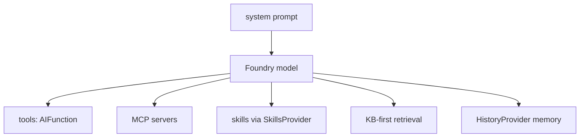
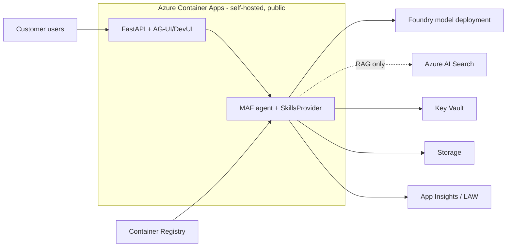

# AI Agent Engagement — Project Context

> Always-on instructions for GitHub Copilot (and any agent that reads `AGENTS.md`).
> This file locks the tech stack and workflow so every engagement is built the same way.
> Keep it short. Detailed rules live in `.github/instructions/`. Reusable workflows live in skills.

## What this repo is

A working **prototype of a customer AI agent** that I (a Microsoft Cloud Solution Advisor for AI)
build during an engagement, then hand to the AI Factory dev team to productionize.

There are **two layers** — do not confuse them:

- **Build assistant (you, Copilot)** = helps me write this project. Uses VS Code agents, instructions, skills, MCP.
- **The deliverable (this code)** = the customer's agent runtime. Built with MAF Python + Microsoft Foundry + Azure services + FastAPI. 

# PART 1 — The agentic solution (the agent itself)

Built with **Microsoft Agent Framework (MAF)**, Python 3.13, latest stable from
`references/agent-framework`. This is the brain + behavior of the deliverable.

## The agentic loop

The agent runs **reason → act (call a tool) → observe → repeat** until it can answer.
Everything below is scaffolding around that loop.

## Tools vs MCP vs Skills (do not conflate)

| Layer | What it is | In MAF |
|---|---|---|
| **Tool** | the model calling a typed Python function (in-process) | `AIFunction` |
| **MCP** | external tools/data over a standard protocol (decoupled, swappable) | `MCPStreamableHTTPTool` |
| **Skill** | a modular capability (`SKILL.md`) that composes tools/MCP/knowledge | loaded via `SkillsProvider` |

Skills are the top-level unit; they *use* tools and MCP.

## Agent topology — choose & justify (the architect's core decision)

After full context, the architect **must decide and justify** the topology — this is a real
tradeoff, not a default. The design must be feasible on **MAF constructs + an available
Foundry model + the standard Azure set** (Part 2).

| Topology | Choose when | MAF construct |
|---|---|---|
| **Single agent + tools/skills** | one coherent job; tools cover the actions; KB covers knowledge | `ChatAgent` + `AIFunction` + `SkillsProvider` |
| **Multi-agent** | distinct specialists with different prompts/tools/models that collaborate | MAF agents calling agents / handoff |
| **Workflow (graph)** | deterministic pipeline with branching, parallel fan-out, or checkpoints | MAF **Workflows** (executors + edges) |

**Strong bias: start single-agent.** Multi-agent or workflow requires explicit justification.
Decision criteria: task decomposition · determinism · parallelism · specialization (different
models/prompts?) · latency/cost (more hops = more tokens) · human-in-the-loop checkpoints.
Most use cases are over-engineered — a single agent with good tools + skills usually wins.

## Design principles (Anthropic — Building Effective Agents)

The architect designs by these, in order:
1. **Start simplest.** Single LLM call + retrieval → workflow → agent. Don't jump ahead.
2. **Add complexity only when it measurably improves outcomes** (latency/cost/quality justify it).
3. **Workflows for predictable tasks, agents for open-ended ones.** Name the pattern when used:
   prompt-chaining · routing · parallelization · orchestrator-workers · evaluator-optimizer.
4. **Design the tools, not just the prompt (ACI).** Clear names, typed args, docstrings with
   examples; make tools hard to misuse. Tool quality ≈ prompt quality.
5. **Transparency.** Expose the agent's planning/steps; trace everything (OpenTelemetry).
6. **Verify.** Every design ends with a check the agent can run (tests / eval).

## MAF patterns

- **Single agent by default** (`ChatAgent` + `FoundryChatClient`); escalate to multi-agent or **workflows** only with justification (see topology decision above).
- **Skills-based**: modular skills under `skills/<name>/SKILL.md`, loaded via `SkillsProvider`.
- **KB-first resolution**: always search the knowledge base (`kb/`) before escalating / acting.
- `HistoryProvider` for memory (FileHistoryProvider in the prototype).
- **Middleware** for cross-cutting concerns (guardrails, Purview) when needed.
- **OpenTelemetry** tracing + **evals from day one** (give the agent a way to verify its work).
- System prompts as module-level constants in `agent.py`. Async by default; type hints; Ruff.

## Agent internals (what the architect diagrams)



---

# PART 2 — The hosting (Azure)

Self-hosted MAF container on Azure. **Keep the prototype simple: public endpoints,
no VNet, RBAC + managed identity.** Network hardening is a productionization step.

## Tech stack — DO NOT deviate without explicit instruction

| Concern | Choice |
|---|---|
| Hosting | **Self-hosted** container on **Azure Container Apps** (NOT Foundry-hosted agents) |
| API | **FastAPI + Uvicorn**; UI via **AG-UI / DevUI** |
| Image registry | **Azure Container Registry** |
| Models / AI platform | **Microsoft Foundry** account + project + model deployment |
| Retrieval | **Azure AI Search** — *only when the use case needs RAG* |
| State / history | **FileHistoryProvider** in the prototype (Cosmos DB is a productionization step) |
| Secrets | **Key Vault** |
| Storage | **Storage account** (Foundry dependency + `kb/` staging) |
| Observability | **Application Insights + Log Analytics** |
| Identity | **`DefaultAzureCredential`** everywhere (managed identity in ACA, `az login` for dev) |
| Config | **`pydantic-settings`** + `.env` |
| IaC | **Bicep** (Azure Verified Modules), `infra/` at repo root |
| Deploy | **`azd`** via the Azure Skills (`azure-prepare` → `azure-validate` → `azure-deploy`) |

## Standard prototype service set (public, simple)

Always: **Container Apps** (+ managed identity) · **Container Registry** · **Foundry**
(account + project + model) · **Storage** · **Key Vault** · **App Insights + Log Analytics**.
Conditional: **Azure AI Search** (only for RAG use cases).
**Not in the prototype:** VNet / private endpoints, Cosmos, APIM, App Gateway/WAF, Purview.

## Solution architecture (what the architect diagrams)



## Target landing zone (Factory hardens later, not in prototype)

Production lands this into Microsoft's **GenAI app landing zone** (hub-spoke):
VNet injection + private endpoints, **APIM** AI gateway, **App Gateway + WAF**,
Cosmos history, Purview, Defender, policy. Reference: `references/bicep-ptn-aiml-landing-zone`.

## Workflow (how I build, per use case)

1. **Discover** — `/init-engagement` (architect agent): interview me, write `docs/context.md`, `docs/SPEC.md`, `README.md` with Mermaid.
2. **Build** — implementer agent: MAF agent in `src/`, skills, FastAPI, mock backend in `mock/`. Always write `tests/`.
3. **Prove** — `/eval`: run tests + Foundry eval. Implementer hands to reviewer only when tests are green.
4. **Infra + deploy** — `azure-prepare` → `azure-validate` → `azure-deploy` (constrained to the stack above).
5. **Review** — reviewer agent: OWASP, `DefaultAzureCredential`, no secrets, least-privilege RBAC.

## Repo layout

```
infra/   src/   skills/   mock/   kb/   tests/   docs/
.github/{copilot-instructions.md, instructions/, agents/, prompts/}
.env.example
```

> MCP is configured once globally (VS Code user-level `mcp.json` + extensions), not per repo.


## What the AI Factory team does next (out of scope for the prototype)

Replace `mock/` with real APIs · swap FileHistoryProvider → CosmosHistoryProvider ·
add prod auth (OBO/SP) · add Purview middleware if required · add Teams channel ·
deploy to ACA with CI/CD.

## References (optional, gitignored)

Clone or symlink these into `references/` for the agents to consult patterns (see README setup):

- **MAF source** → `references/agent-framework` (github.com/microsoft/agent-framework)
- **AI Landing Zone** → `references/bicep-ptn-aiml-landing-zone` (Microsoft GenAI app landing zone)
