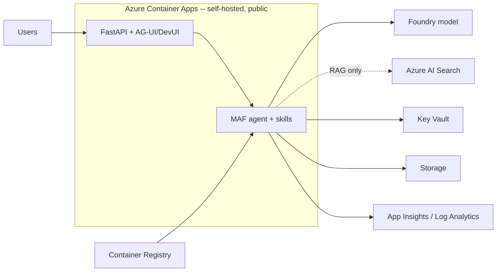
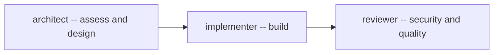

# ai-agent-starter

A ready-to-clone baseline for building **AI agents on Azure with the Microsoft Agent Framework (MAF)**.
Open it in VS Code and GitHub Copilot is pre-configured with the stack, coding rules, three specialized
agents, and slash commands — so you go from an AI use case to a working, deployable prototype fast.

> It ships **configuration + an empty project skeleton**, not application code. The agent for *your*
> use case is generated into `src/`, `skills/`, `infra/`, etc. by the built-in Copilot agents.

---

## What you get

The prototype you build with this starter is a **self-hosted MAF agent on Azure Container Apps**:



**Stack:** MAF (Python 3.13) · FastAPI + AG-UI/DevUI · Azure Container Apps · Microsoft Foundry
(models) · Key Vault · Storage · App Insights/Log Analytics · Container Registry · Bicep (AVM) ·
`DefaultAzureCredential` everywhere. AI Search only for RAG; history is `FileHistoryProvider`
(Cosmos is a productionization step). Public + simple — no VNet. Full details in [AGENTS.md](AGENTS.md).

---

## How it works

Three specialized GitHub Copilot agents hand off to each other across the build:



| Agent | Role |
|---|---|
| **architect** | Read-only "plan mode". Interviews you, debates the agent topology (single vs multi-agent vs workflow), derives the Azure services your design needs, and writes the spec + architecture diagrams. Follows Anthropic's _Building Effective Agents_ principles. |
| **implementer** | Builds the MAF agent, skills, FastAPI app, mock backend, and tests from the spec. Grounds the design in real MAF built-ins; provisions only the derived services. |
| **reviewer** | Adversarial security & quality pass: OWASP + agentic-AI risks, `DefaultAzureCredential`, least-privilege RBAC, spec conformance. |

---

## Prerequisites

Set up once on your machine:

- **VS Code** + **GitHub Copilot** (agent mode). Any Copilot model (Claude recommended).
- **Azure Skills** — `azure-prepare` → `azure-validate` → `azure-deploy`, plus `microsoft-foundry`,
  `azure-rbac`, `azure-ai`, `appinsights-instrumentation`.
  See [Azure Skills](https://learn.microsoft.com/azure/developer/azure-skills/overview).
- **MCP servers** in your VS Code **user** config (`MCP: Open User Configuration`): **Azure MCP**,
  **Microsoft Foundry MCP**, **Bicep MCP** (Foundry/Bicep come from the AI Toolkit & Bicep extensions).
  Optional: **Work IQ MCP** for pulling M365 meeting/email context during discovery.
- **Azure** subscription + `az login`, with Microsoft Foundry access for model deployments.

---

## Get started

**1. Clone into a new folder per use case and open it:**

```bash
git clone https://github.com/hamza-roujdami/ai-agent-starter my-usecase && cd my-usecase && code .
```

**2. (Optional) link the MAF source so agents can cite real samples, and set up local env:**

```bash
mkdir -p references
git clone https://github.com/microsoft/agent-framework references/agent-framework
cp .env.example .env            # fill in, then: az login
python3.13 -m venv .venv && source .venv/bin/activate
```

**3. Drive the workflow from Copilot chat:**

| Step | Command / agent | Output |
|---|---|---|
| 1. Assess & design | `/init-engagement` (architect) | `docs/context.md`, `docs/SPEC.md`, `README.md` + diagrams |
| 2. Build | implementer (via handoff) | MAF agent, skills, FastAPI, mock backend, tests |
| 3. Prove | `/eval` | tests + Foundry evaluation (pass/fail with evidence) |
| 4. Deploy | `/scaffold-infra` | `azure-prepare` → `azure-validate` → `azure-deploy` to ACA |
| 5. Review | reviewer (via handoff) | security & quality findings |

> Tip: bring your customer meeting notes into the chat (or let Work IQ pull them) before
> `/init-engagement` — the architect designs from that context.

---

## What's in the repo

| Path | Purpose |
|---|---|
| `AGENTS.md` | Stack lock + agent-design reference — read by Copilot on every chat |
| `.github/copilot-instructions.md` | Imports `AGENTS.md` + VS Code specifics |
| `.github/instructions/*.instructions.md` | Auto-applied coding rules: Python/MAF, Bicep/AVM, FastAPI, deploy constraints |
| `.github/agents/*.agent.md` | The `architect` → `implementer` → `reviewer` agents (with handoffs) |
| `.github/prompts/*.prompt.md` | Slash commands: `/init-engagement`, `/scaffold-infra`, `/eval` |
| `app/{src,skills,mock,kb,tests}` | The agent you build (empty skeleton, filled per use case) |
| `infra/ docs/` | Deployment IaC and engagement design docs |

MCP is **not** configured per repo — it lives in your single global user `mcp.json` (see Prerequisites).

---

## Committed vs generated

| Committed (the baseline you clone) | Generated per use case (by the agents) |
|---|---|
| `AGENTS.md`, `README.md`, `.gitignore`, `.env.example` | `docs/context.md`, `docs/SPEC.md` (architect) |
| `.github/` instructions, agents, prompts | `app/src/*.py`, `pyproject.toml` (implementer) |
| Empty `app/{src,skills,mock,kb,tests}` + `infra/ docs/` + READMEs | `infra/*.bicep` (azure-prepare) |
| | `app/skills/*/SKILL.md`, `app/mock/*`, `app/kb/*`, `app/tests/*` |
| | Local only (gitignored): `.venv/`, `.env`, `.azure/`, `references/` |

The baseline carries **config + empty skeleton**. The folders ship with a README placeholder so the
agents know what goes where; everything else is written per use case.
